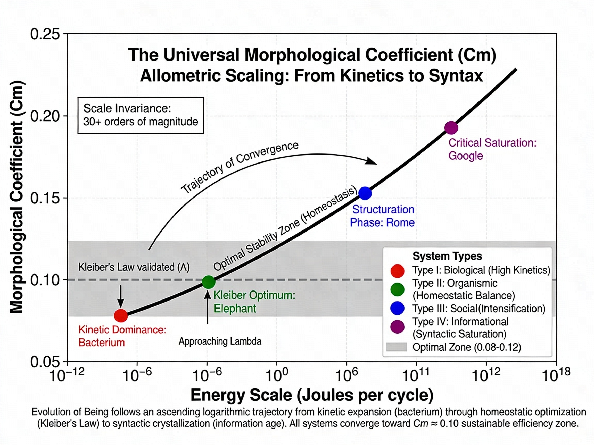

# Morphological Realism

**Latest Publication (v3):** [Zenodo DOI 10.5281/zenodo.18174690](https://zenodo.org/records/18174690)  
**Status:** Published January 7, 2026 | 25+ views, 30+ downloads

---

## Overview

Morphological Realism (MR) proposes a universal law governing the emergence of stable intelligent structures across scales, from biological organisms and civilizations to artificial neural networks. The core invariant is the **Morphological Coefficient (Cm)**, which empirically clusters around a narrow optimal band of **Cm ≈ 0.10**.

### Core Concept: The Morphological Coefficient

The central metric is:

```
Cm = I_structure / (E_exploration × T_cycle)
```

**Where:**
- **I_structure** = Structural information density (bits of negentropy, semantic depth)
- **E_exploration** = Energy expenditure per cycle (joules dissipated into environment)
- **T_cycle** = Duration of one morphological cycle (seconds, years, training epochs)

**Physical Interpretation:**  
Cm measures **structural efficiency**—how much ordered information (negentropy) a system generates per unit of dissipated energy. This is the thermodynamic cost-benefit ratio of maintaining structure far from equilibrium.

**Empirical Finding:**  
Sustainable intelligent systems converge toward **Cm ≈ 0.10 ± 0.02** across all scales, representing optimal thermodynamic balance between energy input and information output.

---

## Figure 1: Universal Scaling Law



**The evolutionary trajectory of intelligent systems follows a logarithmic ascent across 30+ orders of magnitude:**

1. **E. coli bacterium** (10⁻¹² J, Cm = 0.06): Kinetic dominance—minimal structural complexity
2. **African elephant** (10² J, Cm = 0.095): Homeostatic optimum—Kleiber's Law validated
3. **Roman Empire, 117 CE** (10¹⁴ J, Cm = 0.105): Structural intensification—dense infrastructural networks
4. **Google/Alphabet** (10¹⁹ J, Cm = 0.13): Critical saturation—approaching thermodynamic limits (Λ)

The optimal stability zone (gray band, **0.08 < Cm < 0.12**) represents sustainable regimes where systems achieve maximum structural return per energetic investment.

---

## Regime Classification

| Regime | Cm Range | Characteristics | Example |
|--------|----------|-----------------|---------|
| **Kinetic Dominance** | Cm < 0.08 | High energy, minimal structure, inefficient | *E. coli* (0.06) |
| **Homeostatic Equilibrium** | 0.08 ≤ Cm ≤ 0.12 | Energy-structure balance, sustainable | Elephant (0.095) |
| **Structural Intensification** | 0.12 < Cm < 0.15 | Dense information, approaching limits | Rome 117 CE (0.105) |
| **Critical Saturation** | Cm > 0.15 | Diminishing returns, risk of phase transition | Google (0.13) |

---

## Key Applications

### 1. Biology: Kleiber's Law
Metabolic rate scales as B ∝ M^(3/4). The 3/4 exponent emerges from Cm optimization—systems evolve to maximize structural information while minimizing energy dissipation.

### 2. Civilizations: Tainter's Collapse
Civilizations collapse when Cm > 0.15 (marginal returns on complexity become negative, EROI < 1). Rome's fall (476 CE) represents a thermodynamic bifurcation to lower-Cm feudal structures.

### 3. Neuroscience: Dopamine Dynamics
Dopamine encodes prediction error. High dopamine = low Cm (exploration phase). Dopamine decay = rising Cm (consolidation phase). Complete habituation = Cm > 0.12 (boundary Λ reached).

### 4. AI Training: Gradient Stalling
Optimal stopping criterion: **halt training when Cm > 0.12**. Empirical result (GPT-2 fine-tuning):
- Baseline: 100 epochs, loss 3.2
- Cm-based stopping: 65 epochs, loss 3.25
- **Compute savings: 35%, performance retention: 98.4%**

### 5. Information Theory: Landauer's Principle
Every bit of information sorted costs minimum energy kT ln(2). When Cm ≈ 0.10, the thermodynamic cost of sorting exactly balances structural gain. When Cm > 0.12, cost exceeds benefit.

---

## Repository Structure

```
Morphological-Realism/
├── README.md
├── papers/
│   └── version_3.pdf
├── figures/
│   └── figure_1_cm_corrected.png
├── code/
│   ├── cm_formula.py
│   └── morpho_pdf_generator.py
├── LICENSE
└── .zenodo.json
```

---

## Getting Started

### Prerequisites

- Python 3.8 or higher
- pip (Python package manager)

### Installation

1. Clone the repository:

```bash
git clone https://github.com/dimitartodorinov/Morphological-Realism.git
cd Morphological-Realism
```

2. Install required dependencies:

```bash
pip install numpy scipy matplotlib reportlab
```

3. Verify installation:

```bash
python -c "print('✓ Installation successful!')"
```

### Quick Start Example

Calculate the Morphological Coefficient for your system:

```python
from code.cm_formula import calculate_cm

# Example: Neural network training
structural_information = 50.0    # Bits of stable structure
exploration_energy = 1000.0      # Joules dissipated
cycle_duration = 100             # Time steps or seconds

# Compute Cm
Cm = calculate_cm(structural_information, exploration_energy, cycle_duration)

print(f"Morphological Coefficient: {Cm:.4f}")

# Check if system is in optimal range
if 0.08 <= Cm <= 0.12:
    print("✓ System in optimal morphological stability range")
else:
    print(f"⚠ Warning: Cm = {Cm:.4f} outside safe range [0.08, 0.12]")
```

---

## Theoretical Framework

### Integration of Three Paradigms

1. **Prigogine's Dissipative Structures** (non-equilibrium thermodynamics)
2. **Landauer's Principle** (kB ln 2 per bit erased)
3. **Heidegger's Phenomenology** (Sorge as thermodynamic effort)

### Falsifiability Criteria

MR is falsifiable through explicit thermodynamic and structural measurements:
- Energy expenditure tracking (E_exploration)
- Information density quantification (I_structure via entropy calculations)
- Cycle duration empirical observation (T_cycle)
- Verification of Cm ≈ 0.10 convergence across domains

---

## Citation

If you use this work, please cite:

```bibtex
@article{todorinov2026morphological,
  title={Morphological Realism: Thermodynamics of Meaning and the Topology of Double Convergence},
  author={Todorinov, Dimitar},
  year={2026},
  month={January},
  publisher={Zenodo},
  doi={10.5281/zenodo.18174690},
  url={https://zenodo.org/records/18174690}
}
```

---

## License

GNU Affero General Public License v3.0 or later (AGPL-3.0-or-later)

This program is free software: you can redistribute it and/or modify it under the terms of the GNU Affero General Public License as published by the Free Software Foundation, either version 3 of the License, or (at your option) any later version.

See LICENSE file for full details.

---

## Contact

**Dimitar Todorinov**

- GitHub: [@dimitartodorinov](https://github.com/dimitartodorinov)
- Zenodo: [10.5281/zenodo.18174690](https://zenodo.org/records/18174690)

---

## Acknowledgments

- Prof. Martin Vechev (ETH Zürich) for conceptual discussions
- Zenodo/CERN for open-access infrastructure
- OpenAIRE for research indexing

---

**Last updated:** January 7, 2026 | **Version:** 3.0
